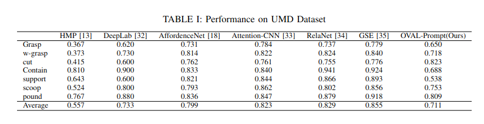
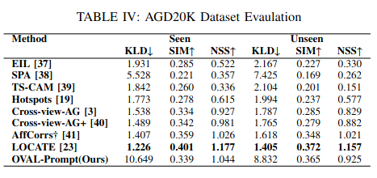

# OVAL-Prompt
Open-Vocabulary Affordance Localization for Robot Manipulation through LLM Affordance-Grounding

## Abstract
In order for robots to use tools effectively, they must understand the form and function of each tool they encounter. In other words, robots need to understand which actions each object affords, and where those affordances can be acted on.Ultimately, robots are expected to operate in unstructured human environments, where the set of objects and affordances is not known to the robot before deployment (i.e. the open-vocabulary setting). In this work we introduce OVAL-Prompt, a prompt-based approach for open-vocabulary affordance localization in RGB-D images. By leveraging a Vision Language Model (VLM) for open-vocabulary object part segmentation and a Large Language Model (LLM) to ground each part-segment-affordance, OVAL-Prompt demonstrates generalizability to novel object instances, categories, and affordances without domain-specific finetuning. Quantitative experiments demonstrate that without any finetuning, OVAL-Prompt achieves localization accuracy that is competitive with supervised baseline models. Moreover, qualitative experiments show that OVAL-Prompt enables affordance-based robot manipulation of open-vocabulary object instances and categories.

### System Overview

### Results

